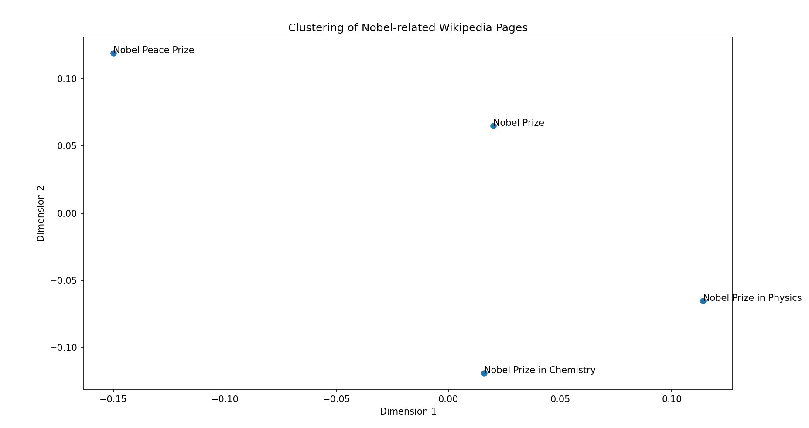

# Text-Analysis-Project

Please read the [instructions](instructions.md).

Project Overview:

In this project, I explored NLP techniques using publicly available textual data from the Wikipedia page on the Nobel Prize. I used the MediaWiki API to extract the page content and applied various analytical methods to uncover insights. These included word frequency analysis to identify commonly used terms, sentiment analysis using NLTK’s VADER to assess the emotional tone of the content, text similarity comparison, and multidimensional scaling (MDS) to visually cluster related Nobel Prize pages. Additionally, I performed topic modeling using scikit-learn’s Latent Dirichlet Allocation (LDA) to discover underlying themes within the text. 

Implementation:

I began by using the MediaWiki API to extract the full content of the "Nobel Prize" Wikipedia page. The text was then processed using a series of custom and library-based functions to clean and tokenize the data, remove stop words, and compute word frequencies. From there, I implemented several analysis components: sentiment analysis with NLTK’s VADER to assess the tone of the content, cosine similarity calculations between  Nobel-related pages, and text clustering using mds from scikit-learn to visualize their relationships. For topic modeling, I used scikit-learn’s LDA to see the underlying themes in the text. A chice I faced was whether to use gensim or scikit-learn for LDA. I chose scikit-learn because I had trouble installing gensim and found scikit-learn’s implementation more beginner-friendly and well-integrated with my document-term matrix setup using CountVectorizer.

To support my learning, I used ChatGPT to better understand how clustering and topic modeling work. I shared my code and questions with the tool, and it helped explain the logic and guide improvements. 

ChatGPT Usage Note:
While trying to perform Clustering and Text Modeling I used ChatGPT to first understand how to conduct the analysis and then used the model to describe how it works. These are the prompts I used:

Prompt 1: What all I can do as a beginner to analyze texts in Python?

Prompt 2:
Topic Modeling:
If you're interested in identifying themes or topics in your text, you can try a simple topic modeling technique like Latent Dirichlet Allocation (LDA) using libraries such as gensim. This can help you discover underlying topics in a collection of texts.

Help me do this. I am using this dataset:  
    wikipedia = MediaWiki()
    nobel = wikipedia.page("Nobel Prize")

Prompt 3: Explain the code to me please

Prompt 4:
I am trying to do this with my nobel dataset. Can you help me understand how to do it
    Text Clustering
    If you can generate pairwise similarities (say using the technique above), you can Metric Multi-dimensional Scaling (MDS) to visualize the texts in a 2-dimensional space. This can help identify clusters of similar texts.

    In order to apply MDS to your data, you can use the machine learning toolkit scikit-learn. Here is some code that uses the similarity matrix defined in the previous section to create a 2-dimensional embedding of the four Charles Dickens and 1 Charles Darwin texts.

    (the code in the instructions)

    This will generate the following plot. The coordinates don't have any special meaning, but the embedding tries to maintain the similarity relationships that we computed via comparing word frequencies. Keep in mind that the point labeled 4 is the work by Charles Darwin and the other are by Charles Dickens.

Prompt 5:
Explain each step in the code to me please

Results:

This project applied several text analysis techniques to understand and visualize the content of the "Nobel Prize" Wikipedia page. First, basic frequency analysis revealed that the most commonly used words were directly related to the award itself, such as “prize” (224 times), “nobel” (195), “awarded” (79), and “peace” (64). This suggests that the page content heavily focuses on the nature of the prize, its history, and its recipients with a special focus on the theme peace.

Using NLTK’s VADER tool for sentiment analysis, the overall emotional tone of the page  was found to be moderately positive, with a compound score of 1.0 and a positive sentiment of 25.9%. This is in line wit what one might expect given that the page highlights prestigious achievements and international recognition.

In terms of text similarity, a comparison between the Nobel Prize and Abel Prize Wikipedia pages using fuzzy matching showed a very low similarity (fuzz.ratio: 16), indicating that the Abel Prize (focused on math) content is quite different in wording and focus.

Topic modeling with scikit-learn’s LDA algorithm revealed three underlying themes in the text which are very cose the ones that we figured using data analysis:

Topic 0: prize, nobel, received, awarded, peace
Topic 1: prize, nobel, awarded, peace, award
Topic 2: nobel, foundation, prizes, prize, swedish

If I was a data analyst I might no use this method as much as it seems more complex without any clear greater beenfit, in my novice expertise.

Finally, the MDS-based text clustering visualized in the figure below shows the relative positioning of various Nobel-related Wikipedia pages. Notably, the Nobel Peace Prize is positioned far from the Physics and Chemistry pages, reflecting the thematic difference between humanitarian awards and science-based achievements.

Reflection:

At the start of the project, I planned to work with the Yelp dataset. I learned how to decompress a .tar file and began exploring the data, but soon realized that processing such a large dataset was computationally intensive and risked crashing my laptop. As a result, I pivoted to using Wikipedia data via the MediaWiki API, which was much more manageable and still offered valuable insights. Learning new data analysis techniques independently—and using tools like ChatGPT to understand both the how and the why—was one of the most insightful parts of the process.

One challenge I faced was understanding the technical requirements and limitations of working with real-world datasets and APIs. While I eventually found success using Wikipedia, I realized that having a stronger conceptual understanding of how NLP models work, as well as more experience with API usage, would have helped me approach the project with more confidence. I also came to appreciate that simpler models can often produce results that are "good enough," and that in many real-world situations, organizations must weigh the trade-offs between accuracy and computational efficiency. The project taught me not only practical skills in text analysis, but also how to make thoughtful decisions when working with data.